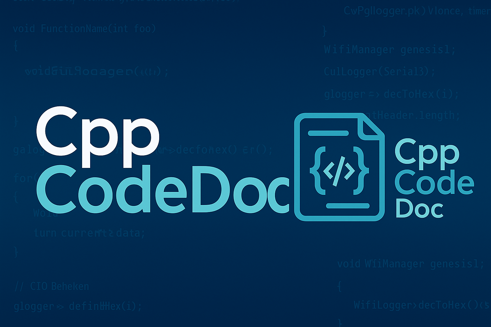
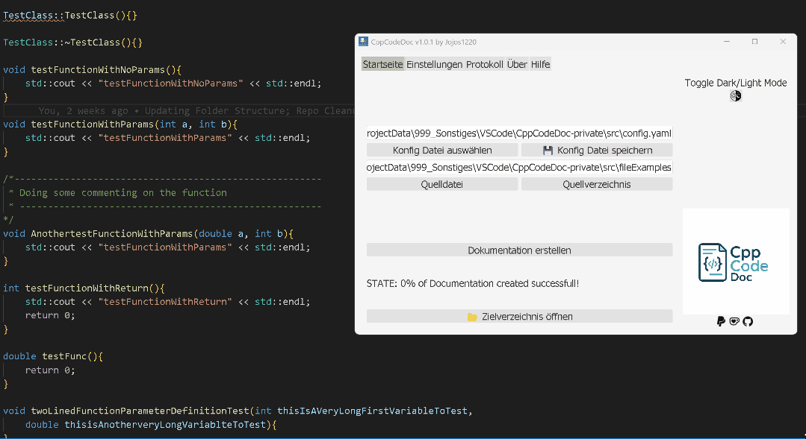

<a name="readme-top"></a>



[![Build][build-shield]][build-url]
[](https://app.codacy.com/gh/JoJos1220/CppCodeDoc/dashboard?utm_source=gh&utm_medium=referral&utm_content=&utm_campaign=Badge_grade)
[](https://app.codacy.com/gh/JoJos1220/CppCodeDoc/dashboard?utm_source=gh&utm_medium=referral&utm_content=&utm_campaign=Badge_coverage)
![License][license-url]
[![Release Version][realease-shield]][release-url]
[![Release Date][releasedate-shield]][releasedate-url]
[![Last commit][lastcommit-shield]][lastcommit-url]
[![Contributors][contributors-shield]][contributors-url]
[![vscode.dev preview][vscode-dev-shield]][vscode-dev-url]
[![Dependabot][depandbot-shield]][depandbot-url]
[![GitHub Actions][githubactions-shield]][githubactions-url]
[![PayPal][Paypal-shield]][paypal-url]
[![Ko-Fi][Ko-Fi-shield]][Ko-Fi-url]

<!-- TABLE OF CONTENTS -->
<details>
  <summary>📚 Table of Contents</summary>
  <ol>
    <li><a href="#idea-and-motivation-behind-the-project">Idea and Motivation behind the Project</a></li>
    <li><a href="#functional-features-in-software">Functional Features in Software</a></li>
    <li><a href="#getting-started">Getting Started</a></li>
    <li><a href="#innovations-in-future-release-roadmap">Innovations in future release (Roadmap)</a></li>
    <li><a href="#contributing">Contributing</a></li>
    <li><a href="#license">License</a></li>
    <li><a href="#contact">Contact</a></li>
    <li><a href="#support">Support</a></li>
  </ol>
</details>

## 💡 Idea and Motivation behind the Project

<p align="right">(<a href="#readme-top">back to top</a>)</p>

While working on C++ projects—mainly using PlatformIO and ESP32/ESP8266/Arduino—I always aim to maintain a consistent and high-quality coding style.
This ensures not only functional code, but also consistent comment styles in function headers and footers.

However, after editing multiple files and debugging complex code, this structure often becomes inconsistent or lost altogether.

To address this, I began creating a tool that searches for uncommented functions or functions with non-standard documentation. After several iterations, the parser's output became satisfying.

That's when the idea was born: “Why not auto-generate function header comments?”

And so, the **CppCodeDoc** project came to life. The tool now enables automatic detection and insertion of header/footer comments, and generates professional-looking documentation as `.html` or `.md`. The report highlights open TODOs and provides a clear overview of documentation progress.

## 🚀 Functional Features in Software

<p align="right">(<a href="#readme-top">back to top</a>)</p>



1) **Automatic Commenting in .cpp, .h, .hpp, .ino and .cxx files** If no header or footer comment is found, the software can automatically insert one—either in default or Doxygen style.

- **Footer comment example**

```cpp
    //FunctionBevore;
    } /* "functionName()" */   
```

- **Default Header Comment**

```cpp
    /*------------------------------------------------------
    * functionName() ToDo
    --------------------------------------------------------*/
    int functionName(){
        // blabla
    }
```

- **Doxygen Header Comment**
        
```cpp
    /**------------------------------------------------------
    * @brief functionName() ToDo
    * @param foo TODO
    * @return TODO
    --------------------------------------------------------*/
    int functionName(int foo){
        // blabla
    }
```

- **Single-line comment conversion example**

From: 

```cpp
    // Hi I am a singleLine comment
    void functionName(int foo){
        // blabla
    }
```

To:

```cpp
    /*------------------------------------------------------
    * Hi I am a singleLine comment
    --------------------------------------------------------*/
    void functionName(int foo) {
        // blabla
    }
```       

2) **Auto Documentation Generation**

   - Output formats: `.md` or `.html`
   - Highlights TODOs in comments
   - Calculates documentation completion percentage

3) **Optional Backup Before Edit**

4) **Various Project-Based-Configuration possibilitys**

5) **Update Checker**

## 🧭 Getting Started

You have several options to use the application:

1) **Run with Python** (recommended for developers): First, install requirements. Then launch via terminal:

```bash
python .\CppCodeDoc.py
```

2) **Use the installer** (simplest setup) Download the latest .exe, call it with administrator privilegs and follow the setup wizard. Python is not required.

3) **Use the CLI (advanced)** For command-line usage without the GUI, run:

```bash
python .\CppCodeDoc.py --NoGui
```

Regardless of the method you choose, the repository must be cloned locally first:

```bash
git clone https://github.com/JoJos1220/CppCodeDoc.git
cd CppCodeDoc
```

*) For command-line usage, make sure Python is installed.

*) When using the installer, Python is not required — all necessary packages are bundled with the installer. Ensure running the installer with admin privilegs.


## 🛣️ Innovations in future release (Roadmap)

<p align="right">(<a href="#readme-top">back to top</a>)</p>

1. **Support for more output formats**  
   Currently, only `.md` and `.html` are supported. PDF export is planned.

2. **Live Preview of Settings in GUI**  
   When adjusting settings that affect documentation appearance, the GUI should immediately show a live preview.

3. **Class-based Grouping of Functions**  
   Functions will be grouped by class in the report, improving clarity.

4. **Add File Header/Footer**  
   Automatic insertion of license headers/footers per file will be implemented.

5. **Feature Requests Welcome**  
   Have a great idea? Don’t hesitate to ask!

## 🤝 Contributing

Everybody is welcome to contribute the project - regardless of the experience level!

1) fork the repository
2) clone your fork on your PC
3) create a branch for your changes
4a) add you changes
4b) make a test-case to ensure the design meets your specification
4c) make and test the software-installer by calling .\scripts\Convert_PyToExe.py script
5) commit and push
6) create a pull request
7) after the pull request is successfull, new release will be created by .\scripts\CreateTagRelease.py script.

<p align="right">(<a href="#readme-top">back to top</a>)</p>

## 📄 License

See also [LICENSE](LICENSE.md) for more information about license rights and limitations about this project.

<p align="right">(<a href="#readme-top">back to top</a>)</p>

## 📬 Contact

You can reach me out directly on Github

Project Link [![Github][github-shield]][github-url]

<p align="right">(<a href="#readme-top">back to top</a>)</p>

## ☕ Support

You Like the Project and want to Support me and my work?

Well, I like coffee ;) Maybe we got a deal?

[][Ko-Fi-url]

[][paypal-url]


<!-- MARKDOWN LINKS & IMAGES -->
[github-shield]: https://img.shields.io/badge/GitHub-Jojos1220-black?logo=github
[github-url]: https://github.com/JoJos1220/CppCodeDoc
[vscode-dev-shield]: https://img.shields.io/badge/preview%20in-vscode.dev-blue
[vscode-dev-url]: https://vscode.dev/github/JoJos1220/CppCodeDoc

[license-url]:https://img.shields.io/github/license/JoJos1220/CppCodeDoc?style=flat-square
[build-shield]: https://github.com/JoJos1220/CppCodeDoc/actions/workflows/build_App.yml/badge.svg
[build-url]: https://github.com/JoJos1220/CppCodeDoc/actions/workflows/build_App.yml
[contributors-shield]: https://img.shields.io/github/contributors/JoJos1220/CppCodeDoc
[contributors-url]: https://github.com/JoJos1220/CppCodeDoc/graphs/contributors
[realease-shield]: https://img.shields.io/github/release/JoJos1220/CppCodeDoc.svg?style=plastic
[release-url]: https://github.com/JoJos1220/CppCodeDoc/releases/latest
[releasedate-shield]: https://img.shields.io/github/release-date/JoJos1220/CppCodeDoc.svg?style=plastic
[releasedate-url]: https://github.com/JoJos1220/CppCodeDoc/releases/latest/
[lastcommit-shield]: https://img.shields.io/github/last-commit/JoJos1220/CppCodeDoc?style=plastic
[lastcommit-url]: https://github.com/JoJos1220/CppCodeDoc/tree
[depandbot-shield]: https://img.shields.io/badge/dependabot-025E8C?style=for-the-badge&logo=dependabot&logoColor=white
[depandbot-url]:https://github.com/JoJos1220/CppCodeDoc/actions/workflows//dependabot/dependabot-updates
[githubactions-shield]: https://img.shields.io/badge/github%20actions-%232671E5.svg?style=for-the-badge&logo=githubactions&logoColor=white
[githubactions-url]:https://github.com/JoJos1220/CppCodeDoc/actions
[paypal-shield]: https://img.shields.io/badge/PayPal-00457C?style=for-the-badge&logo=paypal&logoColor=white
[paypal-url]: https://www.paypal.com/donate/?hosted_button_id=8CTAKMUENCF46
[Ko-Fi-shield]: https://img.shields.io/badge/Ko--fi-F16061?style=for-the-badge&logo=ko-fi&logoColor=white
[Ko-Fi-url]: https://ko-fi.com/G2G3OAILE
